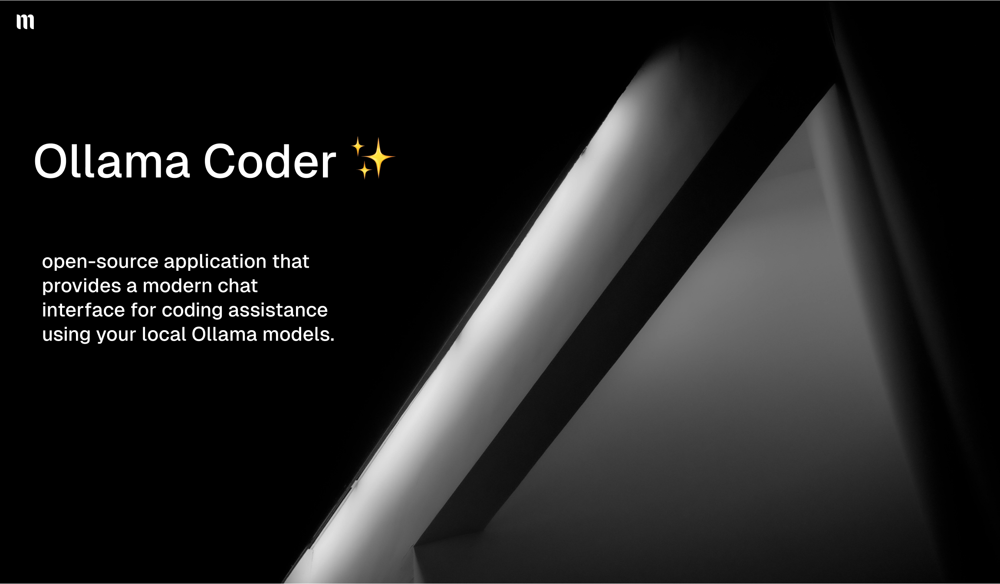

# 🤖 Ollama Coder

A streamlined Streamlit interface for coding with local AI models through Ollama. Powered by [Maux](https://ai.maux.space).

> 💻 Your personal AI coding assistant running entirely on your machine
> 
> 💡 **Want cloud-based AI coding?** Try our hosted version at [ai.maux.space](https://ai.maux.space)

## Description

Ollama Coder is an intuitive, open-source application that provides a modern chat interface for coding assistance using your local Ollama models. It features real-time streaming responses, automatic model detection, and session-based chat history - all running locally on your machine.

## Prerequisites

- Python 3.8+
- Ollama installed and running locally
- At least one model installed in Ollama (e.g., codellama, llama2)

## Installation

1. Clone this repository:
```bash
git clone https://github.com/xmannii/ollama-coder.git
cd ollama-coder
```
2. Install the required packages:
```bash
pip install -r requirements.txt
```
3. Make sure Ollama is running and you have models installed:
```bash
ollama run qwen2.5-coder
```

# Running the App

1. Start the Streamlit app:
```bash
streamlit run app.py
```
2. Open your browser and go to `http://localhost:8501`

## Features

- 🔍 Automatically detects your local Ollama models
- 💬 Modern chat interface with streaming responses
- 📝 Maintains chat history during the session
- 🎨 Clean and intuitive UI
- 🔄 Easy model switching
- 🗑️ Clear chat history option

## Usage

1. Select a model from the dropdown in the sidebar
2. Type your coding question in the chat input
3. The AI will respond with code examples and explanations
4. You can continue the conversation with follow-up questions
5. Use the "Clear Chat History" button to start a new conversation

## Note

Make sure Ollama is running locally at `http://localhost:11434` before starting the app.

## About Maux

This is an open-source project powered by [Maux](https://ai.maux.space). For a hosted solution with additional features and no setup required, visit [ai.maux.space](https://ai.maux.space).

## License

MIT License - feel free to use this code for your own projects!
